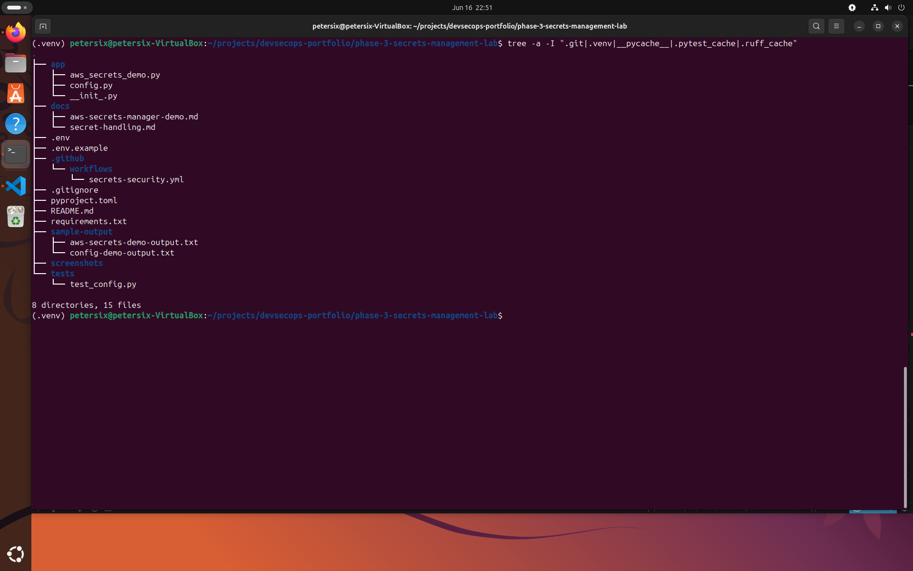
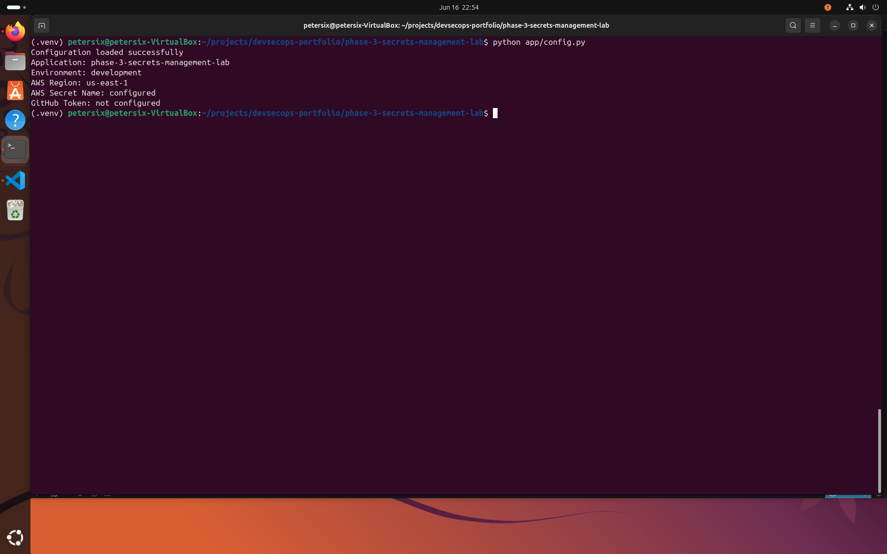
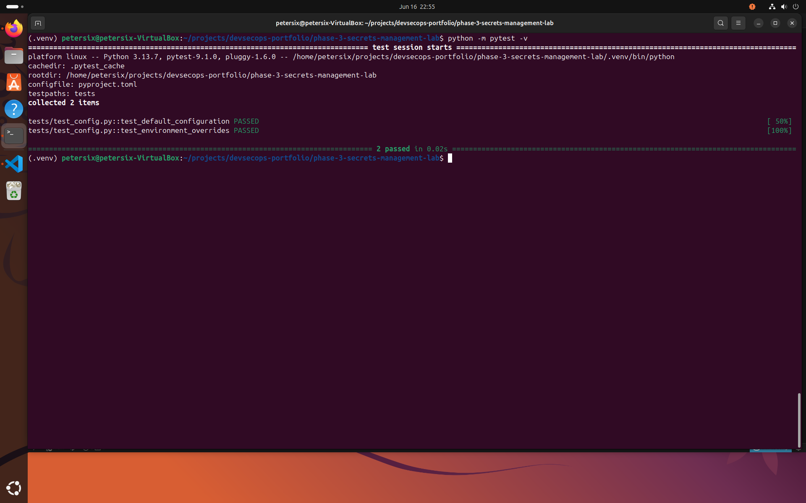
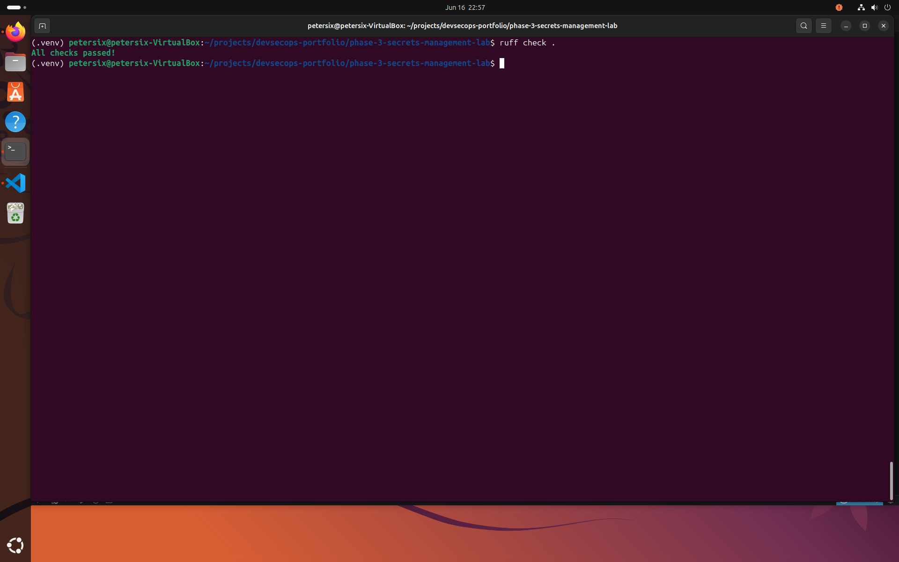
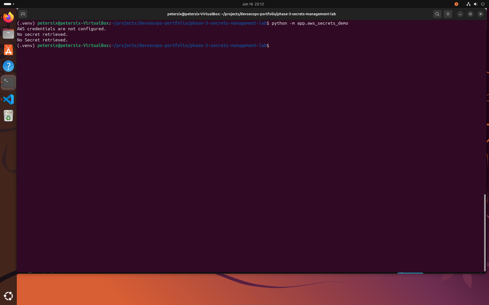
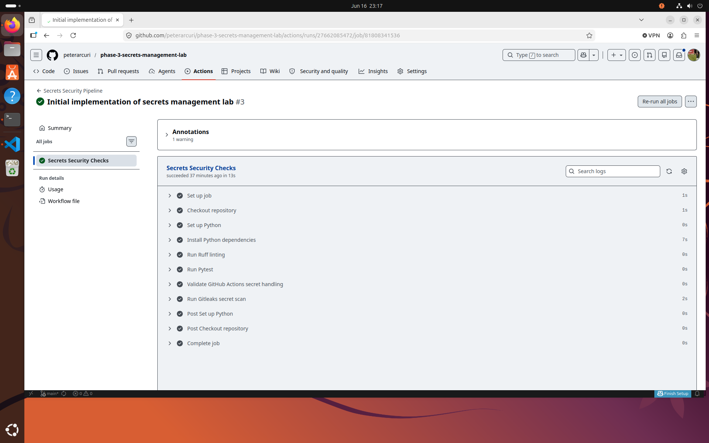
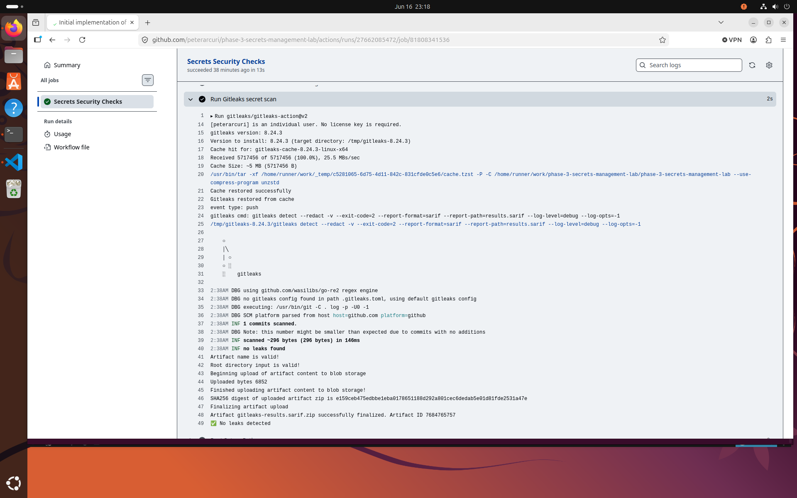

# Phase 3 — Secrets Management Lab

A security-focused DevSecOps project demonstrating modern secret management practices for applications, CI/CD pipelines, and cloud environments.

This lab focuses on eliminating hardcoded credentials and implementing secure secret handling using environment variables, GitHub Actions Secrets, automated secret scanning, and AWS Secrets Manager.

---

# Objectives

This project is designed to strengthen practical DevSecOps skills in:

* Secure credential management
* Environment variable configuration
* GitHub Actions secret handling
* Secret scanning and detection
* AWS Secrets Manager integration
* Secure software delivery practices

---

# Features

## Current Features

* Environment variable configuration management
* `.env.example` template
* No hardcoded secrets
* AWS Secrets Manager integration demo
* GitHub Actions secret usage
* Automated secret scanning with Gitleaks
* Pytest test suite
* Ruff code quality validation

---

## Planned Enhancements

* Secret rotation automation
* IAM policy validation
* Multi-cloud secret management examples
* HashiCorp Vault integration
* Azure Key Vault demonstration
* Kubernetes Secret integration

---

# Project Structure

```text
phase-3-secrets-management-lab/
│
├── .github/
│   └── workflows/
│       └── secrets-security.yml
│
├── app/
│   ├── __init__.py
│   ├── config.py
│   └── aws_secrets_demo.py
│
├── docs/
│   ├── aws-secrets-manager-demo.md
│   └── secret-handling.md
│
├── tests/
│   └── test_config.py
│
├── sample-output/
├── screenshots/
│
├── .env.example
├── .gitignore
├── pyproject.toml
├── requirements.txt
└── README.md
```

---

# Technologies Used

* Python 3.13
* Pytest
* Ruff
* GitHub Actions
* Gitleaks
* AWS Secrets Manager
* Boto3
* Python Dotenv

---

# Installation

Clone the repository:

```bash
git clone <repository-url>
cd phase-3-secrets-management-lab
```

Create a virtual environment:

```bash
python3 -m venv .venv
source .venv/bin/activate
```

Install dependencies:

```bash
pip install --upgrade pip
pip install -r requirements.txt
```

---

# Configuration

Create a local `.env` file:

```env
APP_NAME=phase-3-secrets-management-lab
ENVIRONMENT=development
AWS_REGION=us-east-1
AWS_SECRET_NAME=my-demo-secret
```

Important:

* Never commit `.env`
* Commit only `.env.example`
* Store production secrets in a secure secrets manager

---

# Running the Configuration Demo

Execute:

```bash
python app/config.py
```

Example output:

```text
Configuration loaded successfully
Application: phase-3-secrets-management-lab
Environment: development
AWS Region: us-east-1
```

---

# Running the AWS Secrets Manager Demo

Configure AWS credentials:

```bash
aws configure
```

Run the demonstration:

```bash
python app/aws_secrets_demo.py
```

Example output:

```text
Secret retrieved successfully.
Available keys:
 - username
 - password
 - api_key
```

Secret values are intentionally not displayed.

---

# Running Tests

Execute the test suite:

```bash
python -m pytest -v
```

Expected output:

```text
2 passed
```

---

# Running Code Quality Checks

Execute Ruff:

```bash
ruff check .
```

Expected output:

```text
All checks passed!
```

---

# GitHub Actions Security Pipeline

The GitHub Actions workflow performs:

* Ruff linting
* Pytest execution
* GitHub Actions secret validation
* Gitleaks secret scanning

Workflow file:

```text
.github/workflows/secrets-security.yml
```

---

# Security Controls Demonstrated

## Secret Management

* Environment variables
* `.env.example` templates
* AWS Secrets Manager
* GitHub Actions Secrets

## Secret Detection

* Gitleaks scanning
* Repository scanning
* Commit history scanning
* Pull request scanning

## Secure Development Practices

* No hardcoded credentials
* Least privilege principles
* Secure configuration management
* Separation of code and secrets

---

# Documentation

Additional project documentation is available in:

```text
docs/secret-handling.md
docs/aws-secrets-manager-demo.md
```

---

# Screenshots

## Project Structure

Shows the repository layout including application code, documentation, tests, GitHub Actions workflow, and secret management configuration.



---

## Configuration Loading

Shows the application successfully loading configuration values from environment variables.



---

## Pytest Validation

Demonstrates successful execution of the configuration test suite.



---

## Ruff Validation

Shows code quality checks passing successfully.



---

## AWS Secrets Manager Demonstration

Displays successful retrieval of secret metadata from AWS Secrets Manager.



---

## GitHub Actions Security Pipeline

Shows the GitHub Actions workflow successfully executing all security checks.



---

## Gitleaks Secret Scan

Demonstrates automated secret scanning and validation within the CI/CD pipeline.



---

# Skills Demonstrated

* DevSecOps
* Secret Management
* Cloud Security
* AWS Security
* CI/CD Security
* Secure Configuration Management
* GitHub Actions
* Security Automation
* Python Development
* Security Testing

---

# Disclaimer

This project is intended for educational and portfolio purposes.

Do not store production credentials in source code repositories. Always use dedicated secret management solutions and follow organizational security policies.
